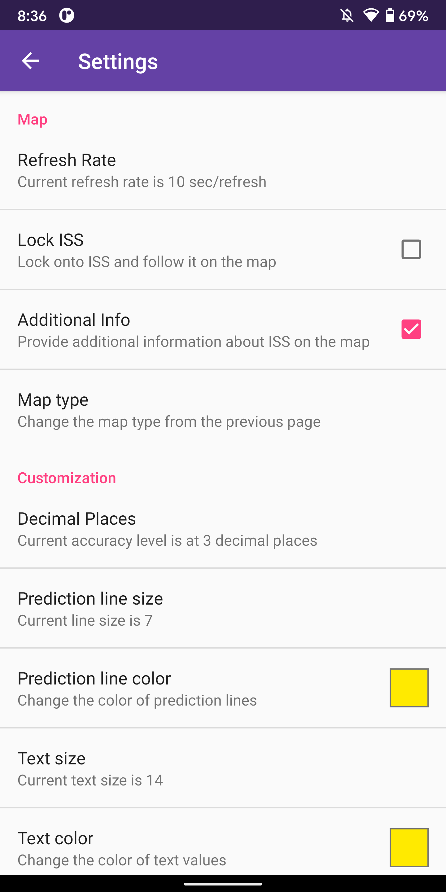

Space Station Tracker
===================

## Introduction
An Android application that keeps track of the International Space Station and notifies you if it's determined to pass by your location in the future. (~hour) Given a clear sky, you should be able to see the station with without any types of equipment. So keep an eye for it. :)

Not counting minor features and helper classes, the app is mostly present through these four activities and their respective java files.

| [MapsActivity](https://github.com/Kiarasht/Space-Station-Tracker/blob/master/app/src/main/java/com/restart/spacestationtracker/MapsActivity.java) | [Location](https://github.com/Kiarasht/Space-Station-Tracker/blob/master/app/src/main/java/com/restart/spacestationtracker/Locations.java) | [PeopleinSpace](https://github.com/Kiarasht/Space-Station-Tracker/blob/master/app/src/main/java/com/restart/spacestationtracker/PeopleinSpace.java) | [Preferences](https://github.com/Kiarasht/Space-Station-Tracker/blob/master/app/src/main/java/com/restart/spacestationtracker/Preferences.java) |
| ------------- | ------------- | ------------- | ------------- |
|  |  |  |  |

This project has come a long way for me. Here is how it was back on [Mar 28, 2016](https://github.com/Kiarasht/Space-Station-Tracker/tree/d7b6d48a4ebcdae9383a428d30a880a652ff3480) and [Apr 2, 2016](https://github.com/Kiarasht/Space-Station-Tracker/tree/05b99d5d8c8298230356caa6153452f77452059d).

